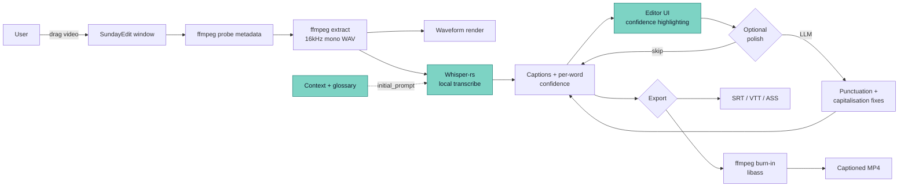
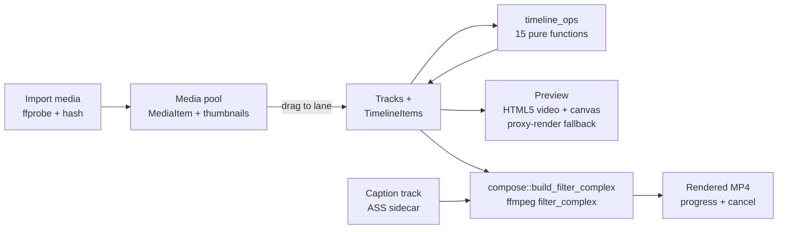

# SundayEdit — Architecture

Last updated: 2026-08-09

## High-level flow



Killer-feature cells highlighted: ASR (with context priming) and Editor (with confidence highlighting).

### NLE path (v0.7.0)

The multi-track editor wraps around the caption pipeline above:



Preview is an approximation (ADR-009); the `filter_complex` export is the
source of truth. Track `enabled` / `muted` / `solo` flags are honored by the
builder, and transitions use the real ffmpeg `xfade` vocabulary (proven by an
integration test composing every picker option with real ffmpeg).

## Data model

> **Multi-track landed (v0.7.0, 2026-08):** the timeline/editor evolved from
> caption-only to a pragmatic multi-track NLE (see `docs/DECISIONS.md`
> ADR-007). Alongside the caption model below, `Project` carries
> `media` / `tracks` / `timeline_items` (see "NLE timeline model"). Captions
> stay first-class — they are simply one `TrackKind`.

```mermaid
erDiagram
  Project ||--|{ Caption        : "ordered list"
  Project ||--o{ Speaker        : "diarization"
  Project ||--o{ GlossaryTerm   : "context"
  Project ||--o| Style          : "default style"
  Project ||--o{ HistoryEntry   : "undo stack"

  Caption ||--|{ Word           : "ordered words"
  Caption }o--o| Speaker        : "attributed"
  Caption }o--o| Style          : "override"
  Caption }o--o| GlossaryAutoCorrection : "applied"

  Word }o--o{ AlternateRead     : "ASR alternates"
```

### Project

| Field                         | Type             | Notes                                          |
| ----------------------------- | ---------------- | ---------------------------------------------- |
| `id`                          | UUIDv7           |                                                |
| `name`                        | string           | derived from video filename initially          |
| `video_path`                  | string           | absolute path                                  |
| `video_content_hash`          | string           | sha-256, for relink on path break              |
| `video_duration_ms`           | i64              |                                                |
| `video_width`, `video_height` | i32              |                                                |
| `video_fps`                   | f32              |                                                |
| `audio_wav_path`              | string?          | cached extracted audio                         |
| `language`                    | string           | ISO 639-1; `auto` for autodetect               |
| `default_style`               | `Style`          | inlined default style                          |
| `context_description`         | string?          | freeform — used as Whisper initial_prompt seed |
| `captions`                    | `Caption[]`      | the caption model below                        |
| `speakers`                    | `Speaker[]`      | diarization                                    |
| `glossary`                    | `GlossaryTerm[]` | context priming                                |
| `clips`                       | `Clip[]`         | social-media clips carved from the talk        |
| `talk_summary`                | string?          | short AI summary of the whole talk             |
| `export_config`               | `ExportConfig`   | persisted export choices                       |
| `project_meta`                | `ProjectMeta`    | title/description/AI-context metadata          |
| `media`                       | `MediaItem[]`    | NLE media pool (`#[serde(default)]`)           |
| `tracks`                      | `Track[]`        | NLE lanes (`#[serde(default)]`)                |
| `timeline_items`              | `TimelineItem[]` | NLE clips (`#[serde(default)]`)                |
| `created_at`, `updated_at`    | i64              | unix ms                                        |

### Caption (one displayed subtitle line)

| Field                | Type    | Notes                                        |
| -------------------- | ------- | -------------------------------------------- |
| `id`                 | UUIDv7  |                                              |
| `project_id`         | FK      |                                              |
| `start_ms`, `end_ms` | i64     | invariant: `start < end`                     |
| `text`               | string  | derived: `words.map(w=>w.text).join(" ")`    |
| `speaker_id`         | UUIDv7? | when diarization is on                       |
| `style_id`           | UUIDv7? | per-caption override                         |
| `notes`              | string? | editor note                                  |
| `ai_generated`       | bool    | from ASR vs hand-typed                       |
| `last_edited_at`     | i64     |                                              |
| **Invariants**       |         | Captions never overlap; sorted by `start_ms` |

### Word

| Field                | Type              | Notes                                                |
| -------------------- | ----------------- | ---------------------------------------------------- |
| `text`               | string            |                                                      |
| `start_ms`, `end_ms` | i64               | derived from Whisper                                 |
| `confidence`         | f32               | 0..100 normalized                                    |
| `edited`             | bool              | user has changed this from ASR                       |
| `locked`             | bool              | user has confirmed (don't flag as uncertain anymore) |
| `alternates`         | `AlternateRead[]` | top-3 Whisper alternates with their probs            |

### GlossaryTerm

| Field                | Type       | Notes                                    |
| -------------------- | ---------- | ---------------------------------------- |
| `id`                 | UUIDv7     |                                          |
| `project_id`         | FK         |                                          |
| `term`               | string     | canonical form                           |
| `aliases`            | `string[]` | misrecognitions auto-corrected to `term` |
| `definition`         | string?    | hover-display                            |
| `pronunciation_hint` | string?    | for Whisper context                      |

### Style

| Field                                                               | Type             | Notes                                 |
| ------------------------------------------------------------------- | ---------------- | ------------------------------------- |
| `id`                                                                | UUIDv7           |                                       |
| `font_family`, `font_size`, `font_weight`, `italic`                 |                  |                                       |
| `color_fg`, `outline_color`, `outline_width`                        |                  |                                       |
| `shadow_color`, `shadow_offset_x`, `shadow_offset_y`, `shadow_blur` |                  |                                       |
| `background_color`, `background_padding`, `background_radius`       |                  |                                       |
| `align_h`, `align_v`                                                |                  | left/center/right × top/middle/bottom |
| `anchor`                                                            | string           | 9-grid position                       |
| `max_width_pct`                                                     | f32              |                                       |
| `line_spacing`, `letter_spacing`                                    |                  |                                       |
| `animation`                                                         | `AnimationSpec?` | fade, slide, karaoke, popup, none     |

## NLE timeline model

The multi-track types live in `src-tauri/src/model.rs` with ts-rs bindings under
`src/lib/bindings`. All new `Project` fields are `#[serde(default)]`, so v4
project files load older projects unchanged.

### MediaItem (an imported source clip)

| Field               | Type        | Notes                                          |
| ------------------- | ----------- | ---------------------------------------------- |
| `id`                | string      |                                                |
| `path`              | string      | absolute path to the source file               |
| `content_hash`      | string      | for relink on path break                       |
| `kind`              | `MediaKind` | video / audio / image (from `services::video`) |
| `duration_ms`       | i64         |                                                |
| `width`, `height`   | i32         |                                                |
| `fps`               | f32         |                                                |
| `has_audio`         | bool        |                                                |
| `audio_wav_path`    | string?     | cached extracted audio                         |
| `original_filename` | string      |                                                |
| `added_at`          | i64         | unix ms                                        |

### Track (a lane on the timeline)

| Field     | Type        | Notes                                     |
| --------- | ----------- | ----------------------------------------- |
| `id`      | string      |                                           |
| `kind`    | `TrackKind` | `Video` / `Audio` / `Caption` / `Overlay` |
| `name`    | string      |                                           |
| `index`   | i32         | stacking order (0 = bottom)               |
| `enabled` | bool        |                                           |
| `locked`  | bool        |                                           |
| `muted`   | bool        |                                           |
| `solo`    | bool        |                                           |

### TimelineItem (a clip placed on a track)

| Field               | Type               | Notes                                                      |
| ------------------- | ------------------ | ---------------------------------------------------------- |
| `id`                | string             |                                                            |
| `track_id`          | string             | FK → `Track`                                               |
| `kind`              | `TimelineItemKind` | `Av` / `Text` / `Graphic`                                  |
| `source_media_id`   | string?            | FK → `MediaItem` (none for pure text/graphic)              |
| `in_ms`, `out_ms`   | i64                | source in/out point                                        |
| `timeline_start_ms` | i64                | where it sits on the timeline                              |
| `speed`             | f32                | playback-rate multiplier                                   |
| `transform`         | `Transform`        | position/scale/rotation/opacity/crop; `Default` = identity |
| `effects`           | `Effect[]`         | opaque `{kind, params}` bag, each toggleable               |
| `transition_in`     | `Transition?`      | `{kind, duration_ms}` at the leading edge                  |
| `text`              | `TextSpec?`        | `{text, style_id}` for Text/Graphic items                  |
| `enabled`, `locked` | bool               |                                                            |

`TimelineItem::timeline_end_ms()` derives the end from
`timeline_start_ms + (out_ms − in_ms) / speed`. `Project::validate_timeline()`
runs after every timeline edit — it checks that each item's track and media
references resolve, that in/out ranges are well-formed and within media bounds,
that `timeline_start_ms` is non-negative, and that items don't overlap on
`Video`/`Audio` tracks — mirroring how `Project::validate` guards the caption
model.

## Confidence tiers — the killer feature

Per-word confidence comes from the ASR model (log-probability of the chosen token, normalized to 0–100). The renderer assigns each word to one of four tiers:

| Tier         | Range  | Visual                         | Meaning                 |
| ------------ | ------ | ------------------------------ | ----------------------- |
| 1 (high)     | 85–100 | No highlight                   | The 92% you don't touch |
| 2 (medium)   | 70–84  | Subtle amber background        | Skimmable               |
| 3 (low)      | 50–69  | Clear amber + dotted underline | Demands a glance        |
| 4 (very low) | 0–49   | Red-orange + wavy underline    | Demands attention       |

**Underlines are an accessibility fallback** — color alone isn't enough. Colorblind users still see SOMETHING.

Tier boundaries are NOT defaults pulled from thin air — they're fitted by the calibration harness. See `docs/CALIBRATION.md` for the headline numbers, the fitting procedure, and the (honestly-labelled) modelled-vs-real provenance of the current dataset.

## Operations (pure functions over Project state)

| Function            | Signature                                            | Notes                                   |
| ------------------- | ---------------------------------------------------- | --------------------------------------- |
| `splitCaption`      | `(project, caption_id, at_word_index)`               | one caption → two                       |
| `mergeCaptions`     | `(project, [caption_ids])`                           | adjacent only                           |
| `shiftAllCaptions`  | `(project, offset_ms)`                               | bulk nudge                              |
| `editWord`          | `(project, caption_id, word_index, new_text)`        | marks `edited`                          |
| `retimeWord`        | `(project, caption_id, word_index, start, end)`      | manual timing                           |
| `lockWord`          | `(project, caption_id, word_index)`                  | removes confidence highlight            |
| `acceptAlternate`   | `(project, caption_id, word_index, alternate_index)` | from tooltip                            |
| `regenerateCaption` | `(project, caption_id)`                              | re-run ASR on this caption's time range |

All operations validate invariants and return a new `Project` state. Undo is trivial: keep the previous state. History is capped (default 100).

### Timeline operations (`services/timeline_ops.rs`)

The NLE follows the same pure-function contract — 15 ops, each
`(&Project, params) -> AppResult<Project>`, each running
`Project::validate_timeline()` before returning:

| Function              | Notes                                                              |
| --------------------- | ------------------------------------------------------------------ |
| `add_media`           | add an imported `MediaItem` to the pool                            |
| `remove_media`        | rejected while any timeline item still references it               |
| `add_track`           | new lane of a given `TrackKind`                                    |
| `remove_track`        | rejected while the track still holds items                         |
| `reorder_track`       | change stacking order                                              |
| `set_track_flags`     | enabled / locked / muted / solo                                    |
| `add_timeline_item`   | place a clip; an overlapping request places into the gap           |
| `split_timeline_item` | split at playhead; lossless spans even at speed ≠ 1 (f64 + guards) |
| `trim_timeline_item`  | clamps against neighbours without sliding content                  |
| `move_timeline_item`  | move along/between tracks                                          |
| `ripple_delete_item`  | delete + close the gap                                             |
| `set_transition`      | leading-edge transition (real ffmpeg `xfade` kinds)                |
| `clear_transition`    |                                                                    |
| `set_transform`       | position/scale/rotation/opacity/crop                               |
| `add_text_item`       | text/graphic item without source media                             |

## Project file format

`.sundayedit` files are SQLite databases — one file per project. Same engine as the in-memory data model; just persisted. This makes loading instant and avoids JSON-parse cost for projects with 5000+ captions.

Caveat for path-stability: if the user moves their video file, SundayEdit detects the missing path on open, hashes candidate files in common locations, and offers to relink. Same pattern as SundayStage's MediaAsset relink (Phase 7.2 there).

## Phase status (August 2026)

Quality infra (Phase 0.2): ESLint/Prettier, Vitest, Playwright e2e, husky +
commitlint, and a PR `ci.yml` gate (web + rust) — all wired.

- [x] Phase 0 — Scaffold + design tokens + confidence color scale + quality infra (0.2)
- [x] Phase 1.1 — Video import: ffprobe metadata, format validation, content-hash relink, `.sundayedit` SQLite file format
- [x] Phase 1.2 — Audio extraction command + multi-zoom waveform peaks + Canvas waveform component
- [x] Phase 1.3 — Full timeline: windowed waveform + ruler + virtualized caption track, drag-move/resize with snap-to-edges/playhead (S toggles), J/K/L shuttle transport, ←/→ caption step, ⌘+scroll zoom-to-cursor. Real `<video>` attached to the playhead clock shipped with the NLE preview (`MediaPlayer`).
- [x] Phase 2.1 — ASR abstraction, Whisper model registry, feature-gated `LocalWhisperProvider`, captionizer, **+ first-run model download** (`asr_download_model`, atomic + progress + cancel)
- [x] Phase 2.2 — Cloud: response normalization (OpenAI/AssemblyAI/Deepgram) + **provider picker, cost preview, upload-consent UX** + **API keys in the OS keychain** (`keyring`) + **OpenAI live upload** + **oversized-upload preflight** (per-provider byte caps surfaced in the picker; OpenAI's 25 MB limit fails early with a clear "use local Whisper / trim" message instead of an opaque API error). Pending: AssemblyAI/Deepgram live calls; chunking large files for OpenAI is a future option.
- [x] Phase 2.3 — Per-word confidence normalization + **calibration harness** (`cargo run --example calibrate`). Curve still uses the v1 estimate until real labelled data is fed in.
- [x] Phase 3.1 — Caption data model + operations
- [x] Phase 3.2 — Editor UX: inline word edit, alternate-picker popover, lock, undo/redo, focus mode
- [x] Phase 3.3 — Confidence highlighting (killer #1): 4 tiers, Tab/Shift-Tab review, threshold, progress
- [x] Phase 3.4 — Context priming + glossary (killer #2): priming + auto-correction + **ContextPanel CRUD UI** + **AI term-suggestion from transcript** (mode 3) + **reference-document extraction** (mode 4: `.txt`/`.md`/`.docx` → LLM term proposals, runnable before transcription; `services::document` does the dependency-free extraction, DOCX via the `zip` crate we already ship). PDF deliberately deferred (no reliable dependency-free parser).
- [x] Phase 4 — AI polish (4.1, substance-guarded), diarization (4.2, sidecar-gated), smart suggestions (4.3, propose-and-approve)
- [x] Phase 5.1/5.3 — Style model + bundled presets + `styleToCss` WYSIWYG (mirrors ASS burn-in)
- [x] Phase 5.2 — Visual style editor: preset gallery, live preview, font/colour/outline/9-grid, safe-area guide
- [x] Phase 6.1 — Export SRT / VTT / ASS / TXT / **JSON** / **DOCX** + **save-to-file** (`save_export`). Pending: SCC/CEA-608 (deliberately deferred).
- [x] Phase 6.2 — Burn-in via libass: pure ffmpeg-arg builder (HW encoder per platform), ASS sidecar, `render()`
- [x] Phase 6.3 — Platform export presets + pre-render validation
- [x] Phase 7 — translation (7.1), filler/silence removal with ripple (7.2), find & replace (7.3)
- [~] Phase 8 — Sunday-link: **deep-link import + caption hand-back done** (inbound `sundayedit://import?…` → parser + renderer seeding of language/context/glossary; outbound `<returnTo>://captions?path=…` after an SRT/VTT save, see `docs/integration.md`). Pending native verification (OS scheme round-trip) + the optional Sunday **Account** (cloud) integration.
- [~] Phase 9 — Onboarding (9.1) done; **distribution pipeline (9.2) live** (signed/notarized release on `v*` tag — universal macOS + Windows, ffmpeg sidecars, auto-update); **full i18n done** (all 7 locales carry the complete catalog). Landing site (9.3): static site built in `site/` — pending deploy.
- [x] **v0.7.0 (2026-08-08) — Multi-track NLE.** Four track kinds, media pool + `MediaBin`, `Timeline` lanes with drag/trim/snap, `ClipInspector`, `MediaPlayer` preview (real `<video>` + canvas overlay + preview-proxy fallback), compose export via ffmpeg `filter_complex` with progress + cancel, sermon highlight-reel studio, universal macOS binary. ADR-007/008/009.
- [x] **Night hardening round (2026-08-08/09).** 22 adversarially confirmed bugs fixed with regression tests (import backfill of the NLE state, track-flags honored in compose, simple-path progress/cancel, CAS store commits, drag/clamp edge cases, …); deferred UI landed (thumbnails, split at playhead, ripple-delete, remove track/media with surfaced rejections); NLE i18n completed ×7 locales; measured render-efficiency pass (memoized Timeline subtrees). Gates: vitest 318, cargo ~635, Playwright 49, 18 real-ffmpeg integration tests.

The in-app **Transcribe** action is wired end-to-end (`App.tsx` →
`features/transcribe/LocalPanel` → `asr_transcribe_local` → editor); what
remains open is native verification against a real device — see
`docs/SMOKE-TEST.md` / `docs/NEEDS-RICHARD.md` — so WER numbers and
real-recording calibration data remain to be collected.
